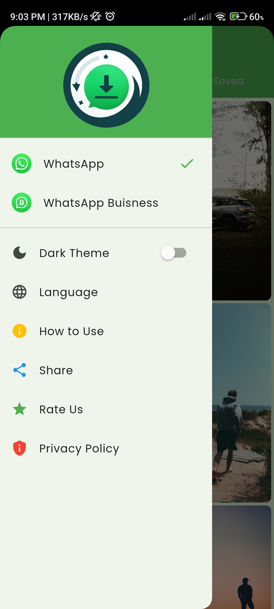

# Whatsapp Status Saver     

A Flutter application designed to save WhatsApp and WhatsApp Business statuses directly to your device's gallery.

## Features

- Personal/Business Whatsapp Statuses
- Light/dark mode toggle
- Localization
- Minimalistic Design
## Demo

To download and install the app, click [here](https://drive.google.com/file/d/13e-uGOBanLM0NKLnzl0_FUvMrojBDmHr/view?usp=sharing).

## Screenshots

  

    

      
    

    

      
    

    

      
    

    

      
    

    

      
    

    <!-- Add more screenshots as needed -->
  

## Roadmap

- Firebase Crashlytics

- Ads Integration

## Author
Created and maintained by Ali Hamza 

#### Note:
The app logo used in this project belongs to [Ali Hamza]([link-to-your-portfolio-or-profile](https://hamzaawan007.github.io/)).

For any inquiries or collaborations, feel free to reach out to me:
- Email: contactalihamza@gmail.com
